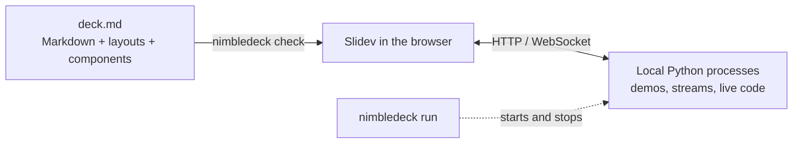

<div class="nd-hero" markdown>

# Slides that run things

<p class="nd-tagline">Write the story in plain Markdown. Add live animation, 3D, Python, video and websites. Present it all from one browser tab.</p>

[Try the live deck](demos/how-it-works/){ .md-button .md-button--primary target="_blank" }
[Get started](GETTING-STARTED.md){ .md-button }

<div class="nd-frame"><iframe src="demos/how-it-works/" title="The Nimbledeck example deck, running" loading="lazy" allow="fullscreen"></iframe></div>
<p class="nd-caption">This is a real Nimbledeck deck. Click it, then use the arrow keys. <a href="demos/">What works on this page</a>.</p>

</div>

## Why Nimbledeck

Nimbledeck is a thin layer on top of [Slidev](https://sli.dev) for decks that need to **run things**. The content
stays Markdown, so a person or an AI agent can write a deck from a document in one pass, and it diffs well in git.

<div class="nd-cards" markdown>

<div markdown>
### Markdown first
One message per slide, a layout name, and nothing else. No `<div>`, no per-slide CSS.
</div>

<div markdown>
### Live components
`Orbit`, `Scene3D`, `PyStream`, `LiveCode`, `Quiz`, `Chart`, `Clip` and more, ready to drop in. [See the gallery](components.md).
</div>

<div markdown>
### Real Python
Heavy work runs in a local process and the slide only displays it. Edit Python on the slide and the plot updates.
</div>

<div markdown>
### Safe on stage
A failing demo shows an offline panel and reconnects on its own. It cannot stop the talk.
</div>

<div markdown>
### Checked for you
`nimbledeck check` lints the Markdown. `nimbledeck verify` opens the deck in Chrome and reports clipped or blurry content.
</div>

<div markdown>
### Themeable
Three built-in looks, and brand themes that restyle every live component through `--nd-*` tokens. [Themes](THEMING.md).
</div>

</div>

## Five minutes to a deck

=== "Write"

    ````md
    ---
    theme: nimbledeck
    ndVariant: night        # plain | paper | night
    title: My talk
    layout: cover
    ---

    # My talk

    #### 2026/01/01

    ---
    layout: default
    ---

    # A live scene

    <Orbit />
    ````

=== "Run"

    ```sh
    node path/to/nimbledeck/packages/cli/bin/nimbledeck.mjs new my-deck
    cd my-deck && npm install
    npm run check    # lint against the slide rules
    npm run dev      # the deck and its demos on http://localhost:3030
    ```

=== "Share"

    ```sh
    npm run verify   # renders every slide in Chrome, reports clipped content
    npm run export   # slides.pdf, one page per build step
    ```

Full walkthrough in [Get started](GETTING-STARTED.md).

## How it fits together



More in [Architecture](ARCHITECTURE.md).

!!! note "Status"
    Early. Everything was run in Chrome on macOS. Windows, Firefox and Safari are not tested yet.
