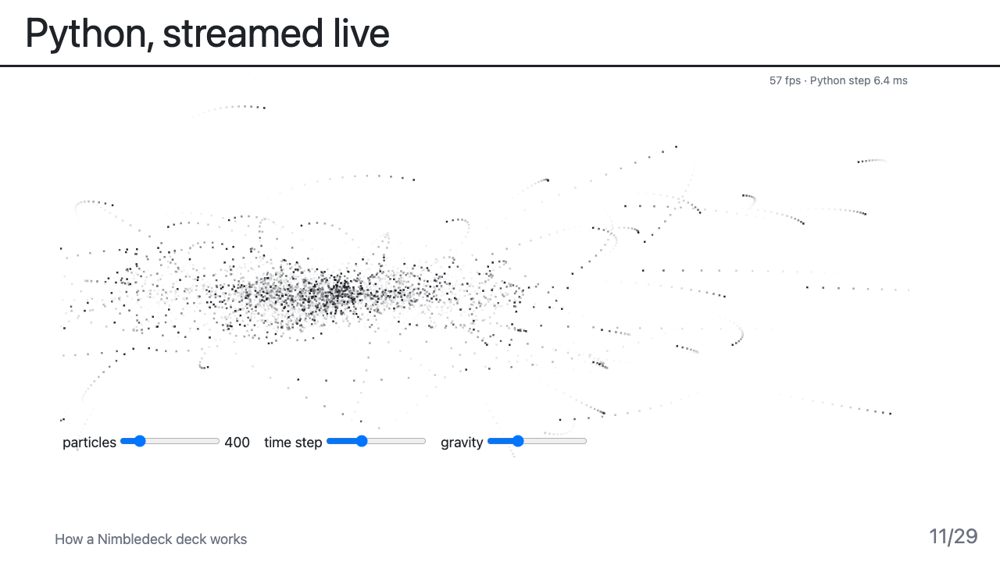
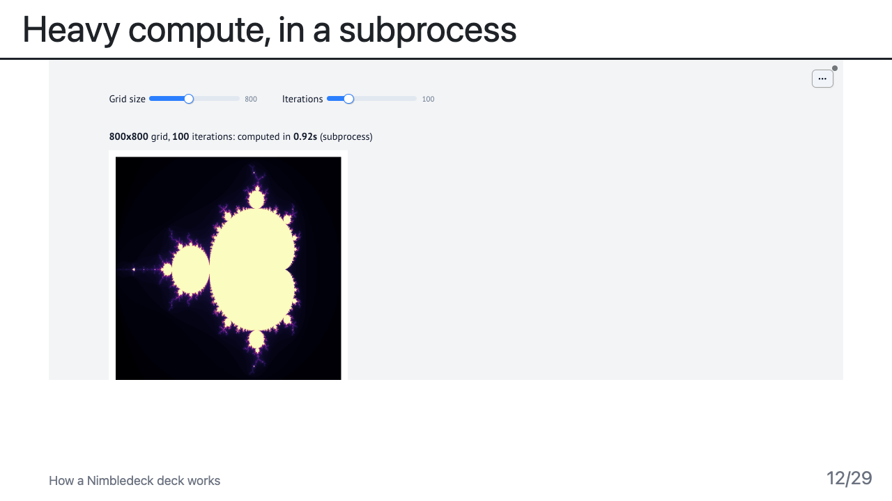
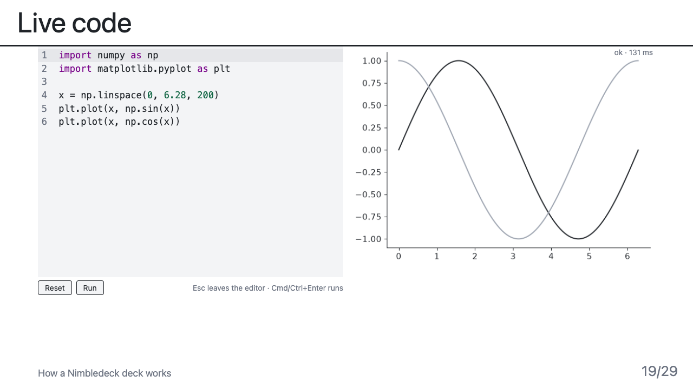
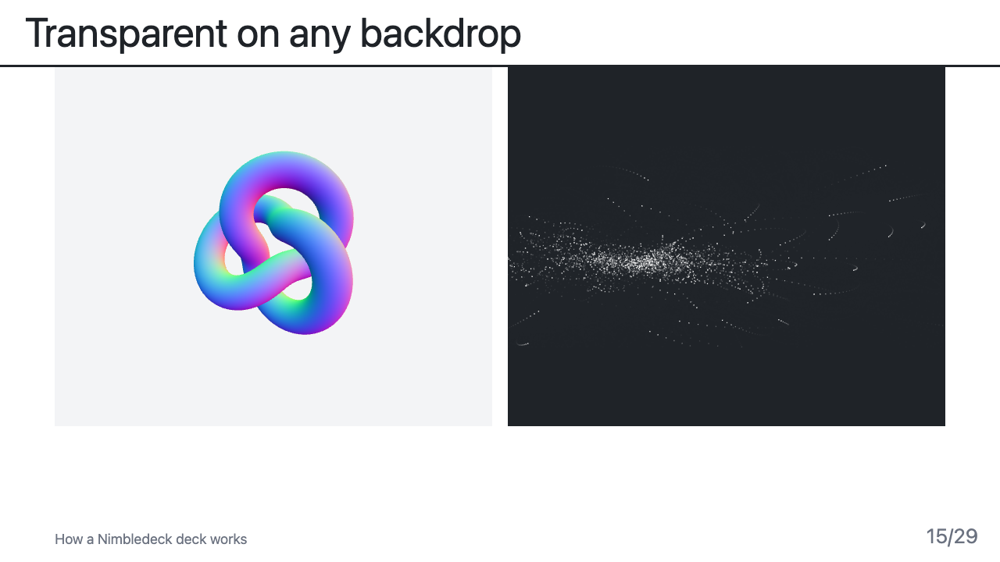

# Run it locally

Some Nimbledeck components need a Python process on your machine, so a static website cannot show them. They are left
out of the [hosted example deck](demos.md) and shown here instead, as they look when `nimbledeck run` is running.

<div class="nd-cards nd-shots" markdown>

<div markdown>


### Python, streamed live
`<PyStream name="nbody" />`. A Python process computes particles and streams them to a canvas at about 60 frames per
second. The sliders send new parameters back to Python.
</div>

<div markdown>


### Heavy compute, in a subprocess
`<Demo name="compute" />`. A [marimo](https://marimo.io) app does its work in a subprocess and the slide only shows it.
If the process is down, the slide shows an offline panel and reconnects by itself.
</div>

<div markdown>


### Live code
`<LiveCode>`. Edit Python next to its result. Printed text and every matplotlib figure update as you type, in about a
tenth of a second. Each run is a separate, limited process.
</div>

<div markdown>


### Transparent on any backdrop
Live components have no background of their own, so they sit on any slide colour. Here a WebGL scene and a Python
stream share one slide.
</div>

</div>

## Try them in three commands

You need Node 20 or newer and [uv](https://docs.astral.sh/uv/) (it fetches Python 3.12 by itself).

```sh
git clone https://github.com/arnaudbletterer/nimbledeck.git
cd nimbledeck && npm install
npm run example        # http://localhost:3030, every demo running
```

Slides 11, 12, 15, 19 and 20 of the example are the ones shown above. The whole system is described in
[Architecture](ARCHITECTURE.md), and what to do before a trip with no connection is in [Working offline](OFFLINE.md).

!!! note "Why not in the browser?"
    Running Python inside the page (WebAssembly) is possible for simple cases, but it would not match what these
    components do locally: native packages, subprocesses, and 60 frames per second from a real process. The hosted deck
    stays honest instead of showing a lookalike.
