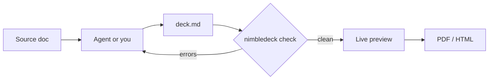

# Building slides that move

#### Nimbledeck example
#### Markdown for the story, components for the motion

<!--
This deck is itself built with the system it describes. Every animation you see is live.
Press ? for all shortcuts, / to search slides, o for the overview, arrow keys to move. Presenter view: /presenter/1 in the address bar.
-->

---
layout: agenda
---

# Agenda

1. The writing loop
   *From a document to a deck, in five steps*
2. What a slide looks like
   *Markdown, a layout name, nothing else*
3. Animation, live
   *Builds, canvas, 3D, Python, video, websites*
4. What it costs
   *Effort, tooling and the rules that keep it solid*

---
layout: divider
---

# The writing loop

---
layout: default
---

# From document to deck



> The checker gives the agent a pass or fail loop, so a deck is validated before anyone looks at it.

---
layout: two-cols
---

::title::

# A slide is Markdown

::default::

````md
---
layout: two-cols
---

::title::

# Search: status

::default::

- Indexing: **done**
- Ranking: in progress

::right::

> Needs a decision this week
````

::right::

Each slide is:

- a `---` separator
- an optional **layout** name
- plain Markdown

No CSS. No HTML. A new look means a new layout, written once.

---
layout: default
---

# Eight layouts, one theme

| Layout | Use it for |
|---|---|
| cover, closing | first and last slide |
| divider | a section break |
| agenda | 3 to 8 numbered items |
| default | bullets, tables, callouts |
| two-cols | two parallel columns |
| photo-right | an idea plus a photo |
| full | a full-frame element, no title bar |

---
layout: divider
---

# Animation, live

---
layout: default
---

# Builds on click

<v-clicks>

- Press the right arrow: one point appears
- Press again: the next one
- This is `<v-clicks>`, one tag around a list

</v-clicks>

<Fly>The block below flies in when the slide opens</Fly>

> PDF export makes one page per click step

---
layout: default
transition: fade
---

# A canvas scene

<Orbit controls />

---
layout: default
---

# A WebGL scene

<Scene3D controls hud />

---
layout: default
---

# Python, streamed live

<PyStream name="nbody" controls hud />

<!--
Python computes an N-body simulation and streams positions over a WebSocket.
Raise the particle count: the frame rate falls as the Python step gets slower, but the deck stays responsive.
-->

---
layout: default
---

# Heavy compute, in a subprocess

<Stage>
<At :w="1140" :h="460" bg="var(--nd-surface)">
<Demo name="compute" />
</At>
</Stage>

---
layout: default
---

# A video clip

<Stage>
<At :w="1140" :h="460">
<Clip src="/clip.mp4" />
</At>
</Stage>

---
layout: default
---

# Everything is an element

<Stage>
<At :w="1140" :h="460" :z="0">
<Clip src="/clip.mp4" fit="cover" />
</At>
<At :w="1140" :h="460" :z="1">
<Orbit />
</At>
<At :x="40" :y="360" :z="2" bg="var(--nd-bg)">

**A live canvas over a video, with text on top.** No frame, no background.

</At>
</Stage>

<!--
Every live component is a plain element. Stage and At layer them freely, and they work with v-click builds.
-->

---
layout: default
---

# Transparent on any backdrop

<Stage>
<At :x="0" :y="0" :w="560" :h="460" bg="var(--nd-surface)">
<Scene3D />
</At>
<At :x="580" :y="0" :w="560" :h="460" bg="var(--nd-ink)">
<PyStream name="nbody" color="#ffffff" />
</At>
<At v-click :x="40" :y="400" :z="2">

Click: this text appears over the live scenes.

</At>
</Stage>

---
layout: full
---

<Stage full>
<At :w="1280" :h="720" :z="0">
<Photo src="/hero.jpg" :dim="0.25" />
</At>
<At :x="90" :y="400" :w="1000" :z="1">
<Headline>Slides that move, written in Markdown</Headline>
</At>
</Stage>

<!--
A full-frame slide: no title bar, no footer. An image with a headline, for impact.
-->

---
layout: full
---

<Stage full>
<At :w="1280" :h="720" :z="0">
<Scene3D :ratio="1.78" />
</At>
<At :x="90" :y="560" :w="800" :z="1">
<Headline size="l" tone="dark">A live 3D scene, full frame</Headline>
</At>
</Stage>

---
layout: full
---

<Site url="https://sli.dev" />

---
layout: default
---

# Live code

<Stage>
<At :w="1140" :h="460">
<LiveCode>

```python
import numpy as np
import matplotlib.pyplot as plt

x = np.linspace(0, 6.28, 200)
plt.plot(x, np.sin(x))
plt.plot(x, np.cos(x))
```

</LiveCode>
</At>
</Stage>

<!--
Click in the editor and change the code: the plot updates as you type. The code runs in a local Python process.
Esc leaves the editor so the arrow keys drive the deck again.
-->

---
layout: default
---

# Live code, run on demand

<Stage>
<At :w="1140" :h="460">
<LiveCode :auto="false">

```python
print("press Cmd/Ctrl+Enter to run me")
```

</LiveCode>
</At>
</Stage>

<!--
For heavy code: nothing runs while you type. Cmd/Ctrl+Enter or the Run button runs it.
-->

---
layout: default
---

# An interactive quiz

<Stage>
<At :x="0" :y="0" :w="1000" :h="460">
<Quiz answer="B">
<Choice letter="A">Lorem ipsum dolor sit amet</Choice>
<Choice letter="B">Consectetur adipiscing elit</Choice>
<Choice letter="C">Sed do eiusmod tempor</Choice>
<Choice letter="D">Incididunt ut labore</Choice>
<Explain letter="B">

The explanation appears once an answer is picked, with the right answer revealed.

</Explain>
</Quiz>
</At>
<At :x="1020" :y="0" :w="120" :h="120">
<Countdown :seconds="20" />
</At>
</Stage>

<!--
Click an answer, or press 1 to 4. Leaving the slide resets the quiz. The countdown starts when the slide opens.
-->

---
layout: default
---

# Flip, compare, count up

<Stage>
<At :x="0" :y="0" :w="360" :h="230">
<Flip>
<template #front>Click to reveal</template>
<template #back>The hidden answer</template>
</Flip>
</At>
<At :x="0" :y="270" :w="360" :h="150">
<Headline size="l" tone="dark"><CountUp :to="3200" suffix="K" /></Headline>
</At>
<At :x="400" :y="0" :w="740" :h="420">
<Compare before="/before.jpg" after="/after.jpg" />
</At>
</Stage>

---
layout: full
---

<Demo name="compute" />

<!--
A full-frame embedded page. Keys and clicks drive the deck until you click the page to interact; then use the bar.
-->

---
layout: default
---

# A website, inside a slide

<Stage>
<At :w="1140" :h="460">
<Site url="https://sli.dev" />
</At>
</Stage>

---
layout: divider
---

# What it costs

---
layout: two-cols
---

::title::

# Effort per kind of change

::default::

- **A slide:** write Markdown
- **A look:** one layout file, once
- **An animation:** one component, once
- **A Python demo:** one `.py` file, one registry line

::right::

> The first time is real work. After that, a deck is mostly writing.

---
layout: default
---

# What it relies on

- **Node and Slidev** for the deck
- **Python and uv** for demos and streams
- **Chrome** for PDF and PNG export
- **A launcher** that starts everything on localhost
- **A checker** that rejects inline HTML and CSS

---
layout: default
---

# Rules that keep it solid

- Live components run only while their slide is on screen
- Heavy work lives in a subprocess, never in the browser
- A crashed demo shows an offline panel, the deck keeps going
- Ports are checked before anything starts

> Tested in the browser: a killed demo never stopped the talk.

---
layout: closing
---

# Discussion

#### What would you build first?
