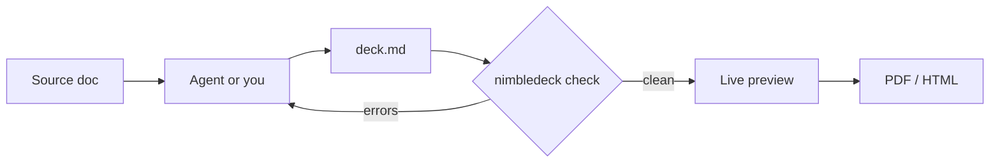

# Building slides that move

#### Nimbledeck example
#### Markdown for the story, components for the motion

<!--
This deck is itself built with the system it describes. Every animation you see is live.
Press P for presenter mode, O for the overview, arrow keys to move.
-->

---
layout: agenda
---

# Agenda

1. The writing loop
   *From a document to a deck, in five steps*
2. What a slide looks like
   *Markdown, a layout name, nothing else*
3. Animation, live
   *Builds, canvas, 3D, Python, video, websites*
4. What it costs
   *Effort, tooling and the rules that keep it solid*

---
layout: divider
---

# The writing loop

---
layout: default
---

# From document to deck



> The checker gives the agent a pass or fail loop, so a deck is validated before anyone looks at it.

---
layout: two-cols
---

::title::

# A slide is Markdown

::default::

````md
---
layout: two-cols
---

::title::

# Search: status

::default::

- Indexing: **done**
- Ranking: in progress

::right::

> Needs a decision this week
````

::right::

Each slide is:

- a `---` separator
- an optional **layout** name
- plain Markdown

No CSS. No HTML. A new look means a new layout, written once.

---
layout: default
---

# Seven layouts, one theme

| Layout | Use it for |
|---|---|
| cover, closing | first and last slide |
| divider | a section break |
| agenda | 3 to 8 numbered items |
| default | bullets, tables, callouts |
| two-cols | two parallel columns |
| photo-right | an idea plus a photo |

---
layout: divider
---

# Animation, live

---
layout: default
---

# Builds on click

<v-clicks>

- Press the right arrow: one point appears
- Press again: the next one
- This is `<v-clicks>`, one tag around a list

</v-clicks>

<Fly>The block below flies in when the slide opens</Fly>

> PDF export makes one page per click step

---
layout: default
transition: fade
---

# A canvas scene

<Orbit />

---
layout: default
---

# A WebGL scene

<Scene3D />

---
layout: default
---

# Python, streamed live

<PyStream name="nbody" />

<!--
Python computes an N-body simulation and streams positions over a WebSocket.
Raise the particle count: the frame rate falls as the Python step gets slower, but the deck stays responsive.
-->

---
layout: default
---

# Heavy compute, in a subprocess

<Demo name="compute" />

---
layout: default
---

# A video clip

<Clip src="/clip.mp4" />

---
layout: default
---

# A website, inside a slide

<Site url="https://sli.dev" />

---
layout: divider
---

# What it costs

---
layout: two-cols
---

::title::

# Effort per kind of change

::default::

- **A slide:** write Markdown
- **A look:** one layout file, once
- **An animation:** one component, once
- **A Python demo:** one `.py` file, one registry line

::right::

> The first time is real work. After that, a deck is mostly writing.

---
layout: default
---

# What it relies on

- **Node and Slidev** for the deck
- **Python and uv** for demos and streams
- **Chrome** for PDF and PNG export
- **A launcher** that starts everything on localhost
- **A checker** that rejects inline HTML and CSS

---
layout: default
---

# Rules that keep it solid

- Live components run only while their slide is on screen
- Heavy work lives in a subprocess, never in the browser
- A crashed demo shows an offline panel, the deck keeps going
- Ports are checked before anything starts

> Tested in the browser: a killed demo never stopped the talk.

---
layout: closing
---

# Discussion

#### What would you build first?
